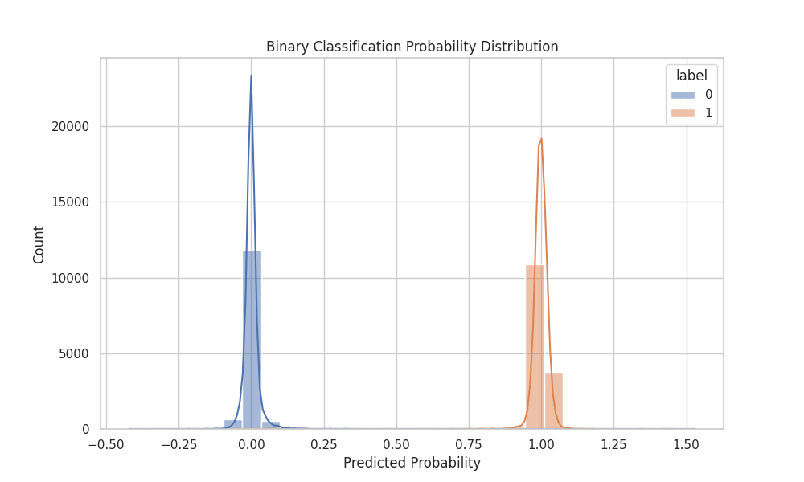

# CCKS2025 大模型生成文本检测
## 项目介绍
本项目立足于CCKS2025 大模型生成文本检测比赛，探索了各种解决方法。比赛的任务是对文本进行分类，语料包含互联网上人类评论，写作，新闻等内容，大模型生成文本包含7个主流大模型生成的文本，目标是给定输入文本判断是大模型生成文本还是人类撰写文本。本项目对于以上任务尝试了将任务建模为二分类任务，回归任务，测试多种模型包括reberta-based模型,qwen,llama,glm等，进行包括sft+lora,全参数微调,lora微调+回归头全参数训练等多种方式进行测试。本项目包含以上测试需要的训练，评估，可视化的代码文件以及任务的数据集文件。

CCKS2025-**大模型生成文本检测**竞赛比赛成绩：**第19名（19/1093）**

## 文件结构说明
- **CCKS2025_LLM-Generated_Text_Detection/** ：包含所需数据文件和代码文件
    - **dataset/** ： 完整训练集文件，A/B榜测试文件
    - **dataset/processed/** ：split后的训练集/验证集文件，用于sft格式的训练文件（参照llamafactory数据预处理）
- **LLM/** ：包含基于LLM的预处理，可视化，zero_shot测试，训练，评估代码
- **SuperAnnotate/** : 包含基于SuperAnnotate/ai-detector（finetuned roberta model）进行微调，评估，可视化代码以及数据集分布代码。

## 安装使用说明
由于不同模型对软件安装的环境配置不同，所以针对本项目如想测试复现所有方法，建议使用conda管理环境，配置不同环境。下面将针对不同的方法说明使用说明。
### 1. 首先克隆仓库到本地
```shell
git clone https://github.com/xixixr/tianchi_LMTextDetect.git
cd tianchi_LMTextDetect-main
```
### 2. 环境配置
- **基于LLM方法的环境配置**
```shell
# 创建conda 环境
conda create -n LLM python=3.11
conda init
conda activate LLM
# 安装依赖包
pip install -r requirements.txt
```

- **基于SuperAnnotate/ai-dector的环境配置**
``` shell
# 创建conda 环境
conda create -n super python=3.11
conda init
conda activate super
# 安装superAnnotate所需环境
pip install git+https://github.com/superannotateai/generated_text_detector.git@v1.1.0 
cd generated_text_detector
pip install -r requirements.txt
# 测试torch
print(torch.cuda.is_available())
# 安装torch(可选)
pip install torch==2.2.1+cu118  torchaudio==2.2.1+cu118  torchvision==0.17.1+cu118 
```
### 3. 不同方案的使用方法
- **基于LLM的回归/分类任务**    
    以下微调或者评估均需要提前下载需要微调的model，并注意修改指定代码中的路径变量，或者利用命令行参数传入。核心思想是在base模型的基础上，取出浅层中层最后一层的最后一个非pad token的hidden_states进行拼接后连接到回归头。参数支持使用不同的loss,是否开启FGM对抗训练，是否采用mean_pooling等。
    - **单卡的情况进行微调**  
    注意当前代码支持qwen，切换其他模型时需要根据模型的实际结构修改自定义模型类中的相关配置
        ``` shell
        conda activate LLM
        cd CCKS2025_LLM-Generated_Text_Detection/LLM
        # LoRA微调
        python finetune_lora.py
        # 全参数微调
        python finetune_all.py
        ```
    - **多卡的情况下可以利用accelerate库进行加速，可以通过修改accelerate_config.yaml文件修改相关配置**  
    注意当前代码支持qwen，切换其他模型时需要根据模型的实际结构修改自定义模型类中的相关配置
        ```shell
        conda activate LLM
        cd CCKS2025_LLM-Generated_Text_Detection/LLM
        # LoRA微调,指定cuda设备进行多卡训练
       CUDA_VISIBLE_DEVICES=1,2,3,4 accelerate launch --config_file accelerate_config.yaml finetune_lora_accelerate.py  
       ```
    - **评估代码**   
        实际实验时为匹配不同模型相关配置的差异，设置了不同的代码快，当前支持（qwen,llama3,GLM4），需要连接到LLM内核之后点击代码块即可运行
    - **可视化代码**  
        可以可视化标签与预测结果的分布情况
        ```shell
        cd CCKS2025_LLM-Generated_Text_Detection/LLM
        python visualize.py
        ```
        可视化分布示意图如下
        
- **基于LLM的指令监督微调任务**  
    同样需要下载指定的模型并配置路径
    - **zero-shot**  
        直接利用模型进行推理测试，判断模型的大致性能
        ```shell
        conda activate LLM
        cd CCKS2025_LLM-Generated_Text_Detection/LLM
        python zero_shot.py
        ```
    - **指令监督微调**  
    可以使用开源项目[llama_factory项目链接](https://github.com/hiyouga/LLaMA-Factory)  
    环境配置
        ```shell
        conda create -n llama_factory python=3.11
        git clone --depth 1 https://github.com/hiyouga/LLaMA-Factory.git
        cd LLaMA-Factory
        conda activate llama_factory
        pip install -e ".[torch,metrics]"
        ```  
        可以参照[说明文档](https://llamafactory.readthedocs.io/zh-cn/latest/index.html)的预处理方法进行自制数据集，同时将数据集注册到data_info.json文件中，同时按照指定的训练方式，配置训练的配置文件
    - **评估代码**
        ```shell
        cd CCKS2025_LLM-Generated_Text_Detection/LLM
        python eval_CausalLM.py
        ```
- **基于SuperAnnotate/ai-detector的回归/分类任务**   
    同样需要下载指定的模型并配置路径
    - **微调**
        ```shell
        conda activate super
        cd /CCKS2025_LLM-Generated_Text_Detection/SuperAnnotate
        python finetune.py
        ```
    - **评估**
        ```shell
        conda activate super
        cd /CCKS2025_LLM-Generated_Text_Detection/SuperAnnotate
        python eval.py
        ```
    - **可视化**   
    数据集原始分布可查看dataset.ipynb  
    可视化评估有label数据分布``` python visualize.py```


## 实验记录
参数配置和实验记录参考Note.md的详细记录，可以分析不同方法的优劣

## 


## 联系与贡献​ 
欢迎通过 GitHub Issues 反馈问题或提交改进建议，共同提升大模型文本检测的准确性与鲁棒性。
